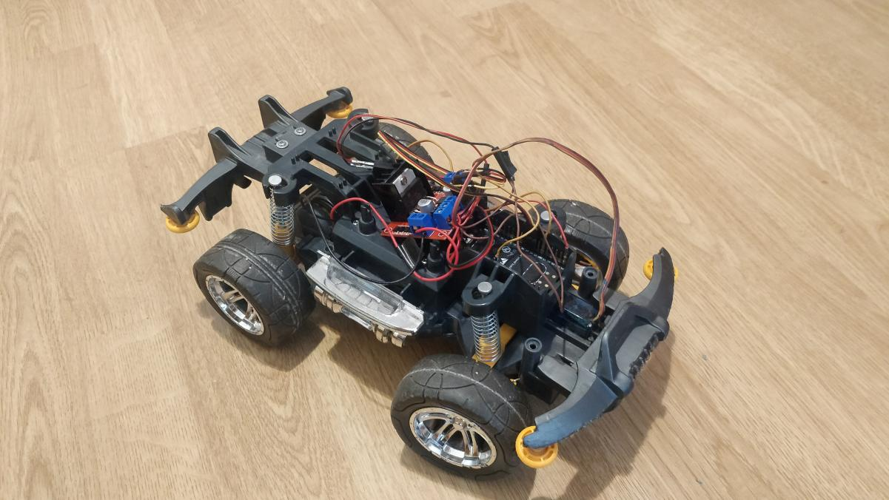
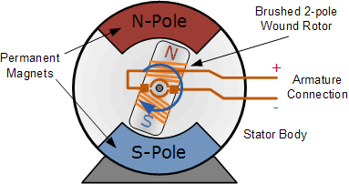
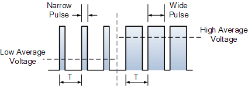
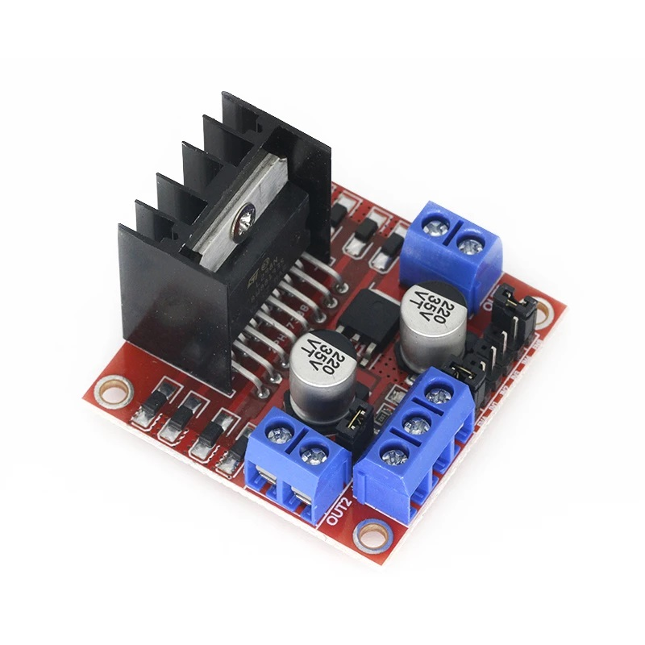
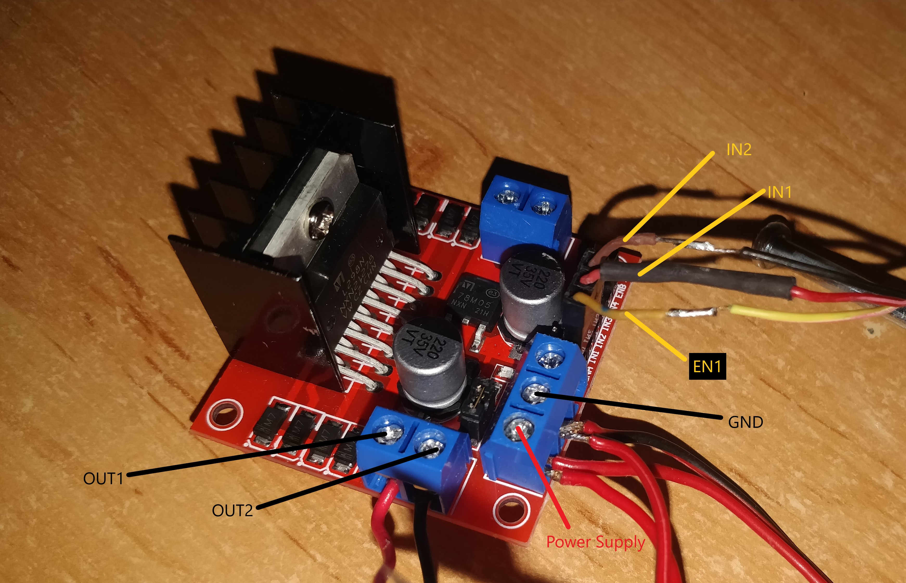
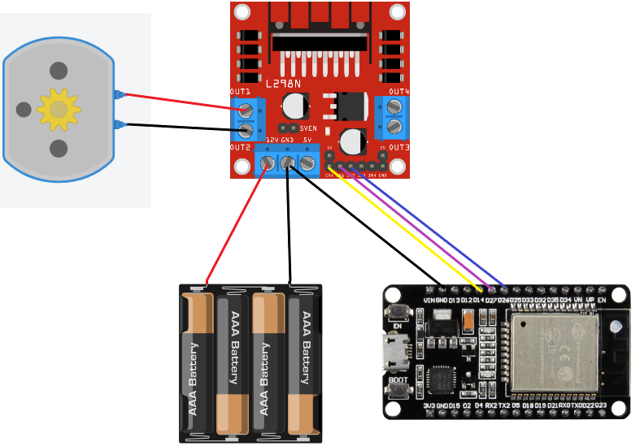
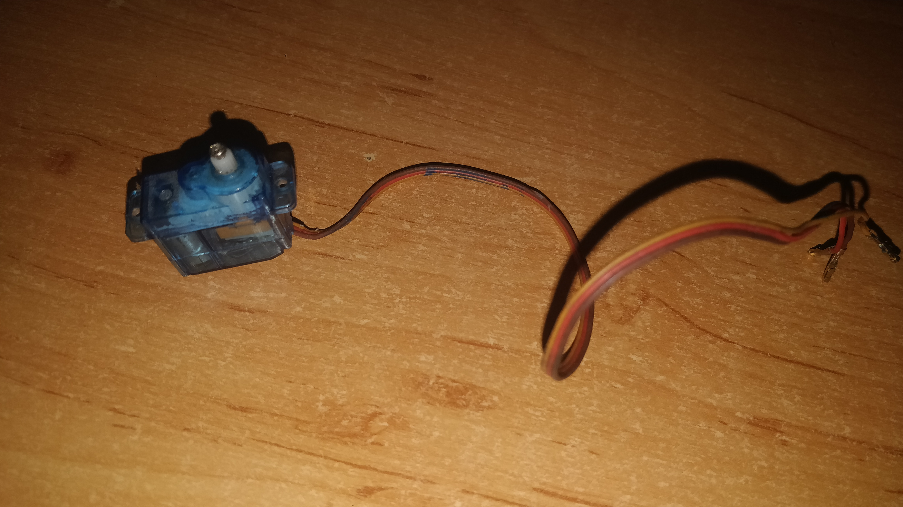
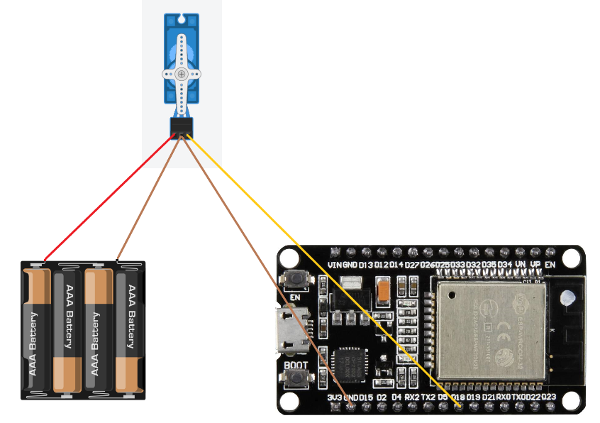

# WIFI-controlled car

This is a project where we build a car that can be controlled by a smartphone via WIFI. The project can be extended to work over the internet, but for now we will just use the local network.



## 1. Parts used in the project
* Prebuilt toy radio controlled car
* [ESPRESSIF ESP32-WROOM-32D](https://eu.mouser.com/new/espressif/espressif-esp32-devkitc-da-development-board/)
* DC motor (normally included in the toy car) or order [here](https://makeradvisor.com/tools/mini-dc-motor/)
* [L298N motor driver](https://www.nkxmotor.si/shop/gonilnik-koracni-motor/l298/l298n-gonilnik-bipolarnega-koracnega-motorja-dvojni-h-most/)
* Power source: 4x 1.5V AA batteries
* [Servo motor SG90](https://www.3dsvet.eu/izdelek/servo-motor-sg90/)
* Jumper wires

## 2. Introduction

The project is written in C++ and uses the Arduino framework. The ESP32 is used as the main controller and the L298N motor driver is used to control the DC motor. 
The ESP32 is connected to the L298N via the GPIO pins. The servo motor is connected to the ESP32 via the GPIO pins. The ESP32 is connected to the toy car via the GPIO pins. The ESP32 is connected to the smartphone via WIFI.

## 3. Controlling the movement of the car (forwards and backwards)

First we need to find a way to accelerate/move the car. Most of the simple toy cars use a DC motor to move the car.

### 3.1. "What is a DC motor and how do we control it?"

A **DC motor** or a **Direct Current motor** is an electrical machine that converts electrical energy into mechanical energy. To achieve that it uses a magnetic field, which then attracts and repels opposite magnets on the rotor. Weather the rotor is attracted or repelled depends on the polarity of the current.

Image of a DC motor:


So how do we control the speed? The speed is controlled with the amount of voltage that is applied across its terminals. We achieve that with a method called **PWM** or **Pulse Width Modulation**. The PWM signal is a square wave with a variable duty cycle. The duty cycle is the ratio of the time the signal is high to the total time of the signal. The higher the duty cycle, the higher the voltage across the terminals. The lower the duty cycle, the lower the voltage across the terminals.

Image of PWM signal:


The problem arises, because we need to control the direction of the motor as well. Also, the motor requires a much higher current than the ESP32 can provide. So we need a motor driver to control the motor. The most common and the one that we'll be using is a H-bridge motor driver. A H-bridge motor driver is a circuit that switches the polarity of the voltage applied to the motor. The H-bridge motor driver that we'll be using is the L298N.

### 3.2. L298N motor driver

The L298N Motor Driver is a motor driver, which allows control of speed and direction of two DC motors at once. The recommended DC motor used is one with the output voltage between 6v and 12V, but it can handle up to 2A and 35V.

Image of the L298N motor driver:


The L298N Motor Driver can control two DC motors at once. Each of the motors uses two output pins and three input pins. Power supply and ground are also required.

Image of the L298N motor driver pins:


#### 3.2.1 Inputs for the motor driver

* EN1: enable pin for motor 1, used for speed control
* IN1: motor 1, pin 1, used for direction control
* IN2: motor 1, pin 2, used for direction control

#### 3.2.2. Enable pins

Enable pin can be a digital or analog signal used for speed control. There are three possible states:
| Signal on the enable pin | State of the motor                                                |
| ------------------------ | ----------------------------------------------------------------- |
| HIGH                     | Motor **enabled**: full speed                                     |
| LOW                      | Motor **not enabled**                                             |
| PWM                      | Motor enabled: **speed proportional** to duty cycle of pwm signal |

#### 3.2.3. Input pins

Input pins are digital signals and are used for spinning direction control. There are three possible states:
| IN1  | IN2  | State of the motor         |
| ---- | ---- | -------------------------- |
| LOW  | LOW  | Motor **stopped**          |
| HIGH | LOW  | Motor running **forward**  |
| LOW  | HIGH | Motor running **backward** |

#### 3.2.4. Power supply

The last thing that we need to understand is the power supply for the motor itself. In theory, the power supply could be from the ESP32, but the ESP32 can only provide 3.3V and the motor requires 6V to 12V. So we need to use a power supply that can provide 6V to 12V. The power supply can be a battery or a power adapter. The powering method we are going to use is simple AA batteries connected in series. We are going to use 4x 1.5V AA batteries, which will give us 6V.

So we need to connect the positive and the negative of the batteries to the positive and the negative of the motor driver. The image and explanation is at [3.2.5. Wiring the motor driver](#325-wiring-the-motor-driver).

### 3.3. Wiring the motor driver

So first we wire up the DC motor to the motor driver. We need to connect the motor to the pins labled as OUT1 and OUT2. The OUT1 is the positive terminal and the OUT2 is the negative terminal.

Now we wire up the power supply. We are going to wire the positive of the power supply to the pin labled as "Power supply" (+12V on the driver) and the negative to "GND".

Its important to note that the "+12V" label on the driver can be connected to anything between 6V and 12V. The "+5V" pin is there, if you want to power the ESP32 from the motor driver, but we are going to power the ESP32 from the power source directly.

The last thing to wire up is the ESP32 to the motor driver. We are going to be using pins 26, 27 and 14. The wiring is as follows:
- pin 26 to the pin labled as "IN2",
- pin 27 to the pin labled as "IN1",
- pin 14 to the pin labled as "EN1" or on the driver as "ENA".

Important: We must not forget the connection of the ground pin from the L298N to the ground pin on the ESP32.

Image of the wiring for the motor driver:


Now that everyting is wired up, we can start programming the ESP32.

### 3.4. Programming the ESP32 for the motor driver control

#### 3.4.1. Setting up the properties and pins for communication

First thing we need to do is prepare the variables and properties for the motor driver.

```cpp
////////////////////
// Motor properties
////////////////////
/// Motor A
int motor1Pin1 = 27;
int motor1Pin2 = 26;
int enable1Pin = 14;
/// Setting PWM properties
const int freq = 30000;
const int dcPwmChannel = 1;
const int resolution = 8;
int dutyCycle = 0;
```

The IN1 and IN2 pins are connected to the GPIO pins 27 and 26. The EN1 pin is connected to the GPIO pin 14. The pins are explained in the [L298N motor driver inputs](#31-inputs-for-the-motor-driver) section.

Then we also setup frequency of the PWM signal, the resolution of the PWM signal and the starting predefine the variable for duty cycle of the PWM signal.

**Frequency** defines the total time the **pwm** signal takes to complete a cycle. I've found that 30kHz is fine for most DC motors used in toy RC cars. But you can try differnet frequencies and see what works best for you.
**PWM channel** is the channel, on which the PWM signal is generated on. The ESP32 has in total 16 different channels for PWM signals.
**Resolution** defines the number of bits used to represent the duty cycle ($2^8=256$, so the max duty cycle is 255, while the min is always 0). You can choose a different value and play with it to see what works best for you.

Now that all the variables are set up, we can attach the GPIO pins to the PWM channels.

```cpp
////////////////////
// motor setup
////////////////////
// sets the pins as outputs:
pinMode(motor1Pin1, OUTPUT);
pinMode(motor1Pin2, OUTPUT);
pinMode(enable1Pin, OUTPUT);

// configure LED PWM functionalitites
ledcSetup(dcPwmChannel, freq, resolution);

// attach the channel to the GPIO to be controlled
ledcAttachPin(enable1Pin, dcPwmChannel);
```

First we set the pins as outputs. Then we need to setup the dcPwmChannel to the correct properties. The last thing we need to do is attach the GPIO pin to the PWM channel.

Now all that is left to do to make the car move is write a function that sets the speed and direction of the motor.

#### 3.4.2. Setting the speed and direction of the motor

For making the car move, we need to write a function, which we will call and pass the speed and direction of the motor as parameters.

```cpp
void setSpeed(int speed)
{
  if (speed > 0)
  {
    // spin motor forward
    digitalWrite(motor1Pin1, HIGH);
    digitalWrite(motor1Pin2, LOW);
  }
  else if (speed < 0)
  {
    // make speed into a positive number
    speed = -speed;
    // spin motor backward
    digitalWrite(motor1Pin1, LOW);
    digitalWrite(motor1Pin2, HIGH);
  }
  else
  {
    // stop motor
    digitalWrite(motor1Pin1, LOW);
    digitalWrite(motor1Pin2, LOW);
  }
  // set speed (duty cycle)
  speed += 150; // add offset (dutyCycle = 150 for 0% speed)
  dutyCycle = speed;
  ledcWrite(dcPwmChannel, dutyCycle); // set duty cycle
}
```

I choose to join the two arguments into one variable (because it was simpler). When the speed is negative, the car will move backward and when the speed is positive, the car will move forward.

First we need to check in which direction should the motor spin. If the speed is more than 0 (speed > 0) we write HIGH or 1 to motor1Pin1 (IN1) and LOW or 0 to motor1Pin2 (IN2). This will make the motor spin forward.
If the speed is less than 0 (speed < 0), we write LOW or 0 to motor1Pin1 (IN1) and HIGH or 1 to motor1Pin2 (IN2). This will make the motor spin backward. We also need to set the speed to a positive number, because we can't write a negative number to the PWM channel (speed = -speed).
In the instance, that the speed is 0, we write LOW or 0 to both motor1Pin1 (IN1) and motor1Pin2 (IN2). This will stop the motor.

At the end all that is left to do is to set the speed (duty cycle) of the motor. The variable speed must be between 0 and 255, because we need chose the **resolution** of the PWM signal to be 8 bits. In this case, I've found that the duty cycle must be offset by 150, because that is on the limit of the car not yet moving at speed 0. If we didn't offset the duty cycle, the car would not move on the range from 0 to 150. At the end we set the duty cycle to the pwmChannel with the function:

```cpp
ledcWrite(dcPwmChannel, dutyCycle)
```

The real number, that is passed to the function is then from 0 to 105, because the offset is 150 and $150 + 105 = 255$.

## 4. Controlling the steering of the car

For steering we are going to use the servo motor. The type of servo motor used is a micro servo SG90. The servo motor has 3 pins: VCC (red), GND (brown) and SIGNAL (yellow). The VCC and the GND pins are used for powering the servo. The SIG pin is used to control the servo via PWM.

Image of the servo motor used:


### 4.1. "What is a servo motor?"

Servo motors use eletricity and mechanical gears to make precise rotational movement. We use it to steer the wheels of the car. The difference between a DC motor and a servo motor is, that a servo motor can be moved to a precise position, while a DC motor can only be moved in a continuous rotation. The servo motor we used can only move 180 degrees, otherwise called a closed loop servo motor, but there are also servo motors that can make continuous rotation known as open loop servo motors. The control for the servo works in a simmilar way as the DC motor control. The width of the pulse sent determines the position of the servo.

### 4.2. Wiring the servo motor

Wiring up the servo motor is pretty simple. We need to connect the VCC pin and the GND pin to a power source and the SIGNAL pin to the GPIO pin of the ESP32. The servo must be powered through the batteries, because the ESP32 can't provide enough power for the servo motor.
Trying to power the servo motor through the ESP32 will most likely result in an error message: “Brownout detector was triggered”, which normally means that the ESP32 is not getting enough power. That is why I recommend using an external power source for the servo motor.
Note: Like with the DC motor, the servo motors GND pin must be connected to the GND pin of the ESP32 for the signal to work.

Image of the wiring for the servo motor:


### 4.3. Programming the ESP32 for the servo motor control
#### 4.3.1. Setting up the properties and pins for communication

First thing we need to do is prepare the variables and properties for the servo motor.

```cpp
//////////////////// 
// Servo motor properties
////////////////////
int servoPin = 18;
int servoPwmChannel = 2;
int minServoVal = 1638;
int maxServoVal = 7864;
```

We are going to be using the GPIO pin 18 for the servo motor. The servo motor is connected to the PWM channel 2. The min and max values are the values for the pulse width of the servo motor. The minServoVal and maxServoVal are explained in [3.4.3. Setting the steering of the car](#343-setting-the-steering-of-the-car).

```cpp
////////////////////
// servo setup
////////////////////
ledcSetup(servoPwmChannel, 50, 16);
ledcAttachPin(servoPin, servoPwmChannel);
```

#### 4.3.2. Setting the steering of the car

For setting the steering of the car we need to write a function, which we will call and pass the steering angle as a parameter. The steering value is a value between 0 and 180. All we have to do is map the value steering, passed into the function to the range of the servo motor. The range of the servo motor in duty cycle terms for the frequency set is from 1638 to 7864. The function for mapping the value is:

```cpp
void setSteering(int steering)
{
  // steering is in degrees 0 to 180
  // convert to PWM count
  int steeringPwmCount = map(steering, 0, 180, minServoVal, maxServoVal);
  // set steering to servoPwmChannel
  ledcWrite(servoPwmChannel, steeringPwmCount);
}
```

When we have the correct duty cycle value, we can set the pwm channel for steering to the value with the function:

```cpp
ledcWrite(servoPwmChannel, steeringPwmCount);
```

Last thing we need to do is somehow connect the servo to the wheels. I did it with a simple wire.


## 5. Controlling the car with a web server

For a web server we are going to use an arduino library called [***ESPAsyncWebServer***](https://github.com/me-no-dev/ESPAsyncWebServer). The library is used to create a web server on the ESP32. The web server is hosted on the ESP32 and will be accessible through the local IP address of the ESP32. The web server will have a simple interface, where we can control the speed and the steering of the car.

First we setup properties for the web server.

```cpp
// wifi connection
const char *ssid = secret_ssid;         // replace
const char *password = secret_password; // replace

AsyncWebServer server(80);
```

First we need to connect the ESP32 to the WiFi network. For this we need to set the SSID and the password of the WiFi network.

```cpp
// initializing
Serial.begin(115200);

// wifi connection
WiFi.begin(ssid, password);
// change the variables ssid and password to your wifi credentials

// wait for connection
while (WiFi.status() != WL_CONNECTED)
{
  delay(1000);
  Serial.println("Connecting to WiFi..");
}
Serial.println(WiFi.localIP());
```

The serial communication is used to print the IP address of the ESP32, so we can access the web server from another device.

Now that the server is connected to the WiFi, we set up the listeners on the server. We need two listeners for each of the commands. One for throttle and one for steering.

```cpp
server.on(
    "/controls/throttle", HTTP_POST, [](AsyncWebServerRequest *request)
    { request->send(200, "text/plain", "OK"); },
    NULL, onBodyThrottle);

server.on(
    "/controls/steering", HTTP_POST, [](AsyncWebServerRequest *request)
    { request->send(200, "text/plain", "OK"); },
    NULL, onBodySteering);
```

The function **server.on()** is used to set up the listener. The first parameter is the URL path of the listener. The second parameter is the HTTP method. The third parameter is the callback function, which is called when the listener is triggered. The fourth parameter is the function that is called when the request is finished. The fifth parameter is the function that is called when the request body is received.

The important parameter is the fifth parameter. The function **onBodyThrottle()** and **onBodySteering()** are the functions that are called when the request body is received. The request body is the data that is sent to the server. In our case the data is the throttle and steering values. The functions are defined as:

```cpp
void onBodyThrottle(AsyncWebServerRequest *request, uint8_t *data, size_t len, size_t index, size_t total)
{
  // parse data with arduino json lib
  DynamicJsonDocument doc(1024);
  DeserializationError error = deserializeJson(doc, data);
  if (error)
  {
    Serial.print(F("deserializeJson() failed: "));
    Serial.println(error.c_str());
    return;
  }
  // get the value of the "speed" field
  int speed = doc["value"];
  Serial.print("Speed chanage:");
  Serial.println(speed);
  // set the speed of the motor
  setSpeed(speed);
}

void onBodySteering(AsyncWebServerRequest *request, uint8_t *data, size_t len, size_t index, size_t total)
{
  // parse data with arduino json lib
  DynamicJsonDocument doc(1024);
  DeserializationError error = deserializeJson(doc, data);
  if (error)
  {
    Serial.print(F("deserializeJson() failed: "));
    Serial.println(error.c_str());
    return;
  }
  // get the value of the "steering" field
  int steering = doc["value"];
  Serial.print("Steering chanage:");
  Serial.println(steering);
  // set steering of servo
  setSteering(steering);
}
```

Both functions **onBodyThrottle()** and **onBodySteering()** are similar. Both receive the body of the request and parse it with the [***ArduinoJson library***](https://arduinojson.org/). Then the value of the field "value" is extracted and the function **setSpeed()** or **setSteering()** is called with the value. Functions are explained in [3.4.2. Setting the speed and direction of the motor](#342-setting-the-speed-and-direction-of-the-motor) and [4.3.2. Setting the steering of the car](#432-setting-the-steering-of-the-car).

The whole ESP32 code is combined in [7.1. ESP32 code](#71-esp32-code) section

Now everything regarding the ESP32 is setup. All we need to do is setup an app that will send the commands to the ESP32.

## 6. Android app

This tutorial will not go into detail about the app itself, but will explain the important parts of the app. You can choose which ever method you prefer, but in this tutorial we are going to be using an Android app written in Kotlin programming language.

### 6.1. Setting up the layout of the app

We need to make a layout first. The layout will have two seekbars, one for the throttle and one for the steering. It will also include a text field for the local ip of the ESP32 and a Confirm button. I used the Android Studio to create the layout. You can use any method.

The layout is defined in the file [**activity_main.xml**](https://github.com/markloboda/esp32_RCCar/blob/main/app/app/src/main/res/layout/activity_main.xml). The layout is defined as:

Now we need to program the app. The app is programmed in Kotlin.

### 6.2. Setting up the code for the app

All we need to do is setup the listeners on the seekbars, to send the data to the ESP32. We do that with the following code:

```cpp
seekBar.setOnSeekBarChangeListener(object : SeekBar.OnSeekBarChangeListener {
  override fun onProgressChanged(seekBar: SeekBar?, progress: Int, fromUser: Boolean) {
  }

  override fun onStartTrackingTouch(seekBar: SeekBar?) {
  }

  override fun onStopTrackingTouch(seekBar: SeekBar?) {
  }
})
```

Each of these three functions is called when something happens to the seekbar. We are only instrested in the **onProgressChanged** and **onStopTrackingTouch** functions. The **onProgressChanged** function is called when the seekbar is moved. The **onStopTrackingTouch** function is called when the user stops moving the seekbar. We need to send a request each time the user moves the seekbar. The code for the **onProgressChanged** function is:

```cpp
override fun onProgressChanged(seekBar: SeekBar?, progress: Int, fromUser: Boolean) {
  val throttle = progress - 105       // throttle is a value between -100 and 100
  sendHttpRequest("throttle", throttle)
}
```

Basically we check the progress and offset it by -105. This way we get negative numbers if the seekbar is on the bottom half of the seekbar and positive numbers if the seekbar is on the top half of the seekbar. Then we call the function **sendHttpRequest()** with the command and the value. The function **sendHttpRequest()** is defined as:

```cpp
private fun sendHttpRequest(command: String, value: Int) {
  val url = "$homeURL/controls/$command"

  val params = HashMap<Any?, Any?>()
  params["value"] = value
  val jsonObject = JSONObject(params)

  val request = JsonObjectRequest(Request.Method.POST, url, jsonObject,
    { response ->
      Log.d("MainActivity", "Response: $response")
    },
    { error ->
      Log.d("MainActivity", "Error: $error")
    }
  )
  queue.add(request)
  }
```

We do the same for steering, but we choose the command "steering" and value of steering.

The code is defined in the file [***MainActivity.kt***](https://github.com/markloboda/esp32_RCCar/blob/main/app/app/src/main/java/com/example/app/MainActivity.kt). The code is defined as:


## 7. Combined code

### 7.1. ESP32 code

File for ESP32 code is [***main.cpp***](https://github.com/markloboda/esp32_RCCar/blob/main/stm/src/main.cpp)

```cpp
#include <Arduino.h>
#include <ArduinoJson.h>
#include <AsyncJson.h>
#include "WiFi.h"
#include "ESPAsyncWebServer.h"
#include "secrets.h"

// wifi connection
const char *ssid = secret_ssid;         // replace
const char *password = secret_password; // replace

AsyncWebServer server(80);

////////////////////
// Motor properties
////////////////////
/// Motor A
int motor1Pin1 = 27;
int motor1Pin2 = 26;
int enable1Pin = 14;
/// Setting PWM properties
const int freq = 30000;
const int dcPwmChannel = 1;
const int resolution = 8;
int dutyCycle = 0;

////////////////////
// Servo motor properties
////////////////////
int servoPin = 18;
int servoPwmChannel = 2;
int minServoVal = 1638;
int maxServoVal = 7864;

////////////////////
// defining functions
////////////////////
void setSpeed(int speed)
{
  if (speed > 0)
  {
    // spin motor forward
    digitalWrite(motor1Pin1, HIGH);
    digitalWrite(motor1Pin2, LOW);
  }
  else if (speed < 0)
  {
    // make speed into a positive number
    speed = -speed;
    // spin motor backward
    digitalWrite(motor1Pin1, LOW);
    digitalWrite(motor1Pin2, HIGH);
  }
  else
  {
    // stop motor
    digitalWrite(motor1Pin1, LOW);
    digitalWrite(motor1Pin2, LOW);
  }
  // set speed (duty cycle)
  speed += 150; // add offset (dutyCycle = 150 for 0% speed)
  dutyCycle = speed;
  ledcWrite(dcPwmChannel, dutyCycle); // set duty cycle
}

void setSteering(int steering)
{
  // steering is in degrees 0 to 180
  // convert to PWM count
  int steeringPwmCount = map(steering, 0, 180, minServoVal, maxServoVal);
  // set steering to servoPwmChannel
  ledcWrite(servoPwmChannel, steeringPwmCount);
}

void onBodyThrottle(AsyncWebServerRequest *request, uint8_t *data, size_t len, size_t index, size_t total)
{
  // parse data with arduino json lib
  DynamicJsonDocument doc(1024);
  DeserializationError error = deserializeJson(doc, data);
  if (error)
  {
    Serial.print(F("deserializeJson() failed: "));
    Serial.println(error.c_str());
    return;
  }
  // get the value of the "speed" field
  int speed = doc["value"];
  Serial.print("Speed chanage:");
  Serial.println(speed);
  // set the speed of the motor
  setSpeed(speed);
}

void onBodySteering(AsyncWebServerRequest *request, uint8_t *data, size_t len, size_t index, size_t total)
{
  // parse data with arduino json lib
  DynamicJsonDocument doc(1024);
  DeserializationError error = deserializeJson(doc, data);
  if (error)
  {
    Serial.print(F("deserializeJson() failed: "));
    Serial.println(error.c_str());
    return;
  }
  // get the value of the "steering" field
  int steering = doc["value"];
  Serial.print("Steering chanage:");
  Serial.println(steering);
  // set steering of servo
  setSteering(steering);
}

void setup()
{
  ////////////////////
  // servo setup
  ////////////////////
  ledcSetup(servoPwmChannel, 50, 16);
  ledcAttachPin(servoPin, servoPwmChannel);

  ////////////////////
  // motor setup
  ////////////////////
  // sets the pins as outputs:
  pinMode(motor1Pin1, OUTPUT);
  pinMode(motor1Pin2, OUTPUT);
  pinMode(enable1Pin, OUTPUT);

  // configure LED PWM functionalitites
  ledcSetup(dcPwmChannel, freq, resolution);

  // attach the channel to the GPIO to be controlled
  ledcAttachPin(enable1Pin, dcPwmChannel);

  // initializing
  Serial.begin(115200);

  // wifi connection
  WiFi.begin(ssid, password);
  // change the variables ssid and password to your wifi credentials

  // wait for connection
  while (WiFi.status() != WL_CONNECTED)
  {
    delay(1000);
    Serial.println("Connecting to WiFi..");
  }
  Serial.println(WiFi.localIP());

  // start server with responses

  server.on(
      "/controls/throttle", HTTP_POST, [](AsyncWebServerRequest *request)
      { request->send(200, "text/plain", "OK"); },
      NULL, onBodyThrottle);

  server.on(
      "/controls/steering", HTTP_POST, [](AsyncWebServerRequest *request)
      { request->send(200, "text/plain", "OK"); },
      NULL, onBodySteering);

  server.begin();
}

void loop()
{
}
```

### 7.2. Android app code

Layout code:
```xml
<?xml version="1.0" encoding="utf-8"?>
<androidx.constraintlayout.widget.ConstraintLayout xmlns:android="http://schemas.android.com/apk/res/android"
    xmlns:app="http://schemas.android.com/apk/res-auto"
    xmlns:tools="http://schemas.android.com/tools"
    android:layout_width="match_parent"
    android:layout_height="match_parent">

    <SeekBar
        android:id="@+id/seekThrottle"
        android:layout_width="200dp"
        android:layout_height="wrap_content"
        android:layout_weight="1"
        android:padding="100dp"
        android:rotation="270"
        app:layout_constraintBottom_toBottomOf="parent"
        app:layout_constraintStart_toStartOf="parent"
        app:layout_constraintTop_toTopOf="parent" />

    <SeekBar
        android:id="@+id/seekSteering"
        android:layout_width="200dp"
        android:layout_height="wrap_content"
        android:layout_weight="1"
        android:padding="100dp"
        app:layout_constraintBottom_toBottomOf="parent"
        app:layout_constraintEnd_toEndOf="parent"
        app:layout_constraintTop_toTopOf="parent" />

</androidx.constraintlayout.widget.ConstraintLayout>
```

Main activity code: [***MainActivity.kt***](https://github.com/markloboda/esp32_RCCar/blob/main/app/app/src/main/java/com/example/app/MainActivity.kt)

```kotlin
package com.example.app

import android.app.Activity
import android.os.Bundle
import android.util.Log
import android.view.Window
import android.widget.SeekBar
import com.android.volley.Request
import com.android.volley.RequestQueue
import com.android.volley.toolbox.JsonObjectRequest
import com.android.volley.toolbox.Volley
import org.json.JSONObject

class MainActivity : Activity() {


    private lateinit var seekThrottle: SeekBar
    private lateinit var seekSteering: SeekBar

    private val homeURL = "http://192.168.64.107"
    private lateinit var queue: RequestQueue


    override fun onCreate(savedInstanceState: Bundle?) {
        super.onCreate(savedInstanceState)
        this.requestWindowFeature(Window.FEATURE_NO_TITLE)
        queue = Volley.newRequestQueue(this)
        setContentView(R.layout.activity_main)
    }

    override fun onPostCreate(savedInstanceState: Bundle?) {
        super.onPostCreate(savedInstanceState)
        seekThrottle = findViewById(R.id.seekThrottle)
        seekSteering = findViewById(R.id.seekSteering)

        seekThrottle.max = 210
        seekThrottle.progress = 105
        seekThrottle.setOnSeekBarChangeListener(object : SeekBar.OnSeekBarChangeListener {
            override fun onProgressChanged(seekBar: SeekBar?, progress: Int, fromUser: Boolean) {
                val throttle = progress - 105       // throttle is a value between -100 and 100
                sendHttpRequest("throttle", throttle)
            }

            override fun onStartTrackingTouch(seekBar: SeekBar?) {
            }

            override fun onStopTrackingTouch(seekBar: SeekBar?) {
                // reset the seekbar to 100 if the user stops touching it
                seekThrottle.progress = 105
            }
        })
        seekSteering.max = 80
        seekSteering.progress = 40
        seekSteering.setOnSeekBarChangeListener(object : SeekBar.OnSeekBarChangeListener {
            override fun onProgressChanged(seekBar: SeekBar?, progress: Int, fromUser: Boolean) {
                val steering = seekSteering.max - progress      // turning is a value between 0 and 180
                sendHttpRequest("steering", steering)
            }

            override fun onStartTrackingTouch(seekBar: SeekBar?) {
            }

            override fun onStopTrackingTouch(seekBar: SeekBar?) {
                // reset the seekbar to 100 if the user stops touching it
                seekSteering.progress = 90
            }
        })

        seekSteering.max = 180
        seekSteering.progress = 90

    }

    private fun sendHttpRequest(command: String, value: Int) {
        val url = "$homeURL/controls/$command"

        val params = HashMap<Any?, Any?>()
        params["value"] = value
        val jsonObject = JSONObject(params)

        val request = JsonObjectRequest(Request.Method.POST, url, jsonObject,
            { response ->
                Log.d("MainActivity", "Response: $response")
            },
            { error ->
                Log.d("MainActivity", "Error: $error")
            }
        )
        queue.add(request)
    }
}
```