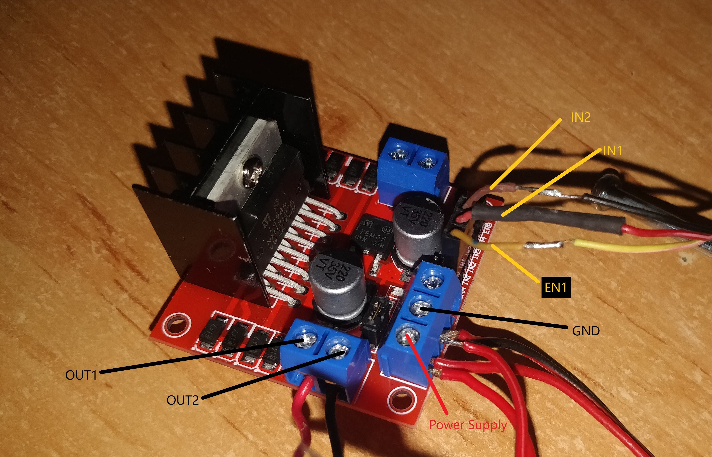
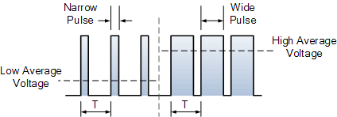

# WIFI-controlled car

This is a project where we build a car that can be controlled by a smartphone via WIFI. The project can be extended to work over the internet, but for now we will just use the local network.

# IMAGE OF THE CAR... maybe a gif #

## 1. Parts used in the project
* Prebuilt toy radio controlled car
* [ESPRESSIF ESP32-WROOM-32D](https://eu.mouser.com/new/espressif/espressif-esp32-devkitc-da-development-board/)
* DC motor (normally included in the toy car) or order [here](https://makeradvisor.com/tools/mini-dc-motor/)
* [L298N motor driver](https://www.nkxmotor.si/shop/gonilnik-koracni-motor/l298/l298n-gonilnik-bipolarnega-koracnega-motorja-dvojni-h-most/)
* Power source: 4x 1.5V AA batteries
* [Servo motor SG90](https://www.3dsvet.eu/izdelek/servo-motor-sg90/)
* Jumper wires

## 2. Introduction

The project is written in C++ and uses the Arduino framework. The ESP32 is used as the main controller and the L298N motor driver is used to control the DC motor. 
The ESP32 is connected to the L298N via the GPIO pins. The servo motor is connected to the ESP32 via the GPIO pins. The ESP32 is connected to the toy car via the GPIO pins. The ESP32 is connected to the smartphone via WIFI.

## 3. L298N motor driver

The L298N Motor Driver is a motor driver, which allows control of speed and direction of two DC motors at once. The recommended DC motor used is one with the output voltage between 6v and 12V, but it can handle up to 2A and 35V.

Image of the L298N motor driver:


The L298N Motor Driver can control two DC motors at once. Each of the motors uses two output pins and three input pins. Power supply and ground are also required.

Image of the L298N motor driver pins:


### 3.1 Inputs

* EN1: enable pin for motor 1, used for speed control
* IN1: motor 1, pin 1, used for direction control
* IN2: motor 1, pin 2, used for direction control

#### Enable pins

Enable pin can be a digital or analog signal used for speed control. There are three possible states:
| Signal on the enable pin | State of the motor                                                |
| ------------------------ | ----------------------------------------------------------------- |
| HIGH                     | Motor **enabled**: full speed                                     |
| LOW                      | Motor **not enabled**                                             |
| PWM                      | Motor enabled: **speed proportional** to duty cycle of pwm signal |

Code for speed control:
```c++
// set speed (duty cycle)
speed += 150; // add offset (dutyCycle = 150 for 0% speed)
dutyCycle = speed;
ledcWrite(dcPwmChannel, dutyCycle); // set duty cycle
```
[Explanation of duty cycle](#).

#### Input pins

Input pins are digital signals and are used for spinning direction control. There are three possible states:
| IN1  | IN2  | State of the motor         |
| ---- | ---- | -------------------------- |
| LOW  | LOW  | Motor **stopped**          |
| HIGH | LOW  | Motor running **forward**  |
| LOW  | HIGH | Motor running **backward** |

Code for direction control in C++:
```c++
if (speed > 0)
  {
    // spin motor forward
    digitalWrite(motor1Pin1, HIGH);
    digitalWrite(motor1Pin2, LOW);
  }
  else if (speed < 0)
  {
    // make speed into a positive number
    speed = -speed;
    // spin motor backward
    digitalWrite(motor1Pin1, LOW);
    digitalWrite(motor1Pin2, HIGH);
  }
  else
  {
    // stop motor
    digitalWrite(motor1Pin1, LOW);
    digitalWrite(motor1Pin2, LOW);
  }
```

## 4. Setting up PWM properties and pin configuration for the DC motor

We now need to setup the properties to the correct values for the DC motor to work. First we need to understand: [**"What is a DC motor and how do we control it?"**](#what-is-a-dc-motor-and-how-do-we-control-it).

### "What is a DC motor and how do we control it?"

A **DC motor** or a **Direct Current motor** is an electrical machine that converts electrical energy into mechanical energy. To achieve that,it uses a magnetic field, which then attracts and repels magnets on the rotor. Weather the rotor is attracted or repelled depends on the polarity of the current. The polarity of the current is controlled by the input pins of the L298N motor driver.

Image of a DC motor:


So how do we control the speed? The speed is controlled with the amount of voltage that is applied across its terminals. We achieve that with a method called **PWM** or **Pulse Width Modulation**. The PWM signal is a square wave with a variable duty cycle. The duty cycle is the ratio of the time the signal is high to the total time of the signal. The higher the duty cycle, the higher the voltage across the terminals. The lower the duty cycle, the lower the voltage across the terminals.

Image of PWM signal:


### Settings up PWM properties

First we need to define pins, to which the L298N motor driver is connected to. We also need to define some properties of the PWM signal. 

```c++
////////////////////
// Motor properties
////////////////////
/// Motor A
int motor1Pin1 = 27;
int motor1Pin2 = 26;
int enable1Pin = 14;
/// Setting PWM properties
const int freq = 30000;
const int dcPwmChannel = 1;
const int resolution = 8;
int dutyCycle = 200;
```

The IN1 and IN2 pins are connected to the GPIO pins 27 and 26. The EN1 pin is connected to the GPIO pin 14. The pins are explained in the [L298N motor driver inputs](#31-inputs) section.

Then we also setup frequency of the PWM signal, the resolution of the PWM signal and the starting predefine the variable for duty cycle of the PWM signal.

**Frequency** defines the total time the **pwm** signal takes to complete a cycle.
**Resolution** defines the number of bits used to represent the duty cycle ($2^8=256$, so the max duty cycle is 255, while the min is always 0).

### Controling the DC motor
```c++
void setSpeed(int speed)
{
  if (speed > 0)
  {
    // spin motor forward
    digitalWrite(motor1Pin1, HIGH);
    digitalWrite(motor1Pin2, LOW);
  }
  else if (speed < 0)
  {
    // make speed into a positive number
    speed = -speed;
    // spin motor backward
    digitalWrite(motor1Pin1, LOW);
    digitalWrite(motor1Pin2, HIGH);
  }
  else
  {
    // stop motor
    digitalWrite(motor1Pin1, LOW);
    digitalWrite(motor1Pin2, LOW);
  }
  // set speed (duty cycle)
  speed += 150; // add offset (dutyCycle = 150 for 0% speed)
  dutyCycle = speed;
  ledcWrite(dcPwmChannel, dutyCycle); // set duty cycle
}
```
This is a function, that sets the speed of the rotor to the value of the parameter **speed**. Parameter **speed** is a value between -105 and 105.
First we setup the direction of the motor. The direction control is explained in the [L298N motor driver Input Pins](#input-pins) section.
Then we set the speed of the motor. The speed of the motor, as mentioned above is set using the pwm method. Our board has 16 channels for controlling pwm signals. We use channel 1 for controlling the speed of the motor. We add 150 to the speed, because the starting duty cycle value is 150. We chose the starting duty cycle value with trial and error. The DC motor starts spinning after the duty cycle surpasses 150. That is also the reason why we use the speed value on the scale from 0 to 105 ($150 + 105 = 255$). We set the duty cycle to the pwm channel of the dc motor with the function **ledcWrite**.

## 5. Controling the servo motor

